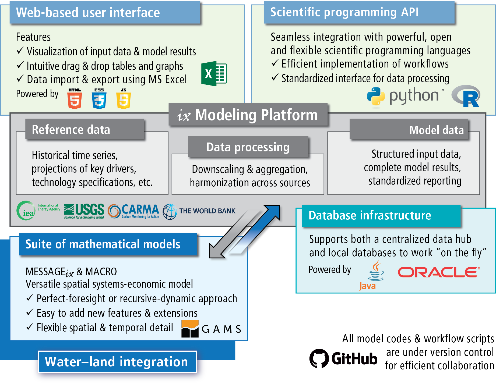

|MESSAGEix| model & framework
*****************************

|MESSAGEix| is a *framework* that can be used to develop and run many different
*models*, each describing a different energy system. Models in the |MESSAGEix|
framework can range from very simple (as in the :doc:`tutorials`) to highly
detailed (e.g. the MESSAGE-GLOBIOM global model).
The framework can be applied to analyse scenarios of the energy system transformation under technical-engineering constraints and political-societal considerations.

Framework components
====================

   Components and their interlinkages in the |ixmp| (:cite:`Huppmann-2018`): web-based user interface, scientific
   programming interface, modeling platform, database backend, implementation
   of the |MESSAGEix| mathematical model formulation.

**MESSAGE** is a specific mathematical formulation of a model developed for strategic energy planning and integrated assessment of energy-engineering-economy-environment systems (E4).
The formulation included in :mod:`message_ix` is a re-implementation and extension of “MESSAGE V” (Messner and Strubegger, 1995 :cite:`Messner-Strubegger-1995`), the integrated assessment model developed at |IIASA| since the 1980s.
The optimization model can be linked to the general-equilibrium **MACRO** model to incorporate feedback between prices and demand levels for energy and commodities.
The :mod:`message_ix` package includes code for both MESSAGE, MACRO, and the MESSAGE-MACRO link.
These are written in the `GAMS`_ mathematical programming language.
:mod:`message_ix` uses GAMS to compute the numerical solution of a model instance.

.. _`GAMS`: http://www.gams.com

These models are built upon on the |ixmp| (:mod:`ixmp`), software that provides a data warehouse for high-powered numerical scenario analysis.
The platform supports an efficient workflow between original input data sources, the implementation of the mathematical model formulation, and the analysis of numerical results.
The platform can be accessed via application programming interfaces (API) in the scientific programming languages Python and R, as well as a web-based user interface.
The platform also handles outputting model data (for MESSAGE, MACRO, or user-defined models) to the GAMS :file:`.gdx` file format, and invoking GAMS code such as the MESSAGE implementation.

Supported features
==================

The framework allows direct and explicit representation of:

- Energy **technologies** with arbitrary inputs and outputs, that can be used
  to describe a “reference energy system,” including:

  - the fuel supply chain,
  - conversion technologies from primary to secondary energy forms,
  - transmission and distribution (e.g. of electricity), and
  - final demand for energy services.

- **Vintaging** of capacity, early retirement and decommissioning of
  technologies.
- System integration of **variable renewable energy sources** (based on
  Sullivan et al., 2013 :cite:`Sullivan-2013` and Johnson et al., 2016
  :cite:`Johnson-2016`).
- Soft relaxation of **dynamic constraints** on new capacity and activity
  (Keppo and Strubegger, 2010 :cite:`Keppo-2010`).
- **Perfect-foresight** and **dynamic-recursive** (myopic) solution algorithms.

.. _running:

Running a model
===============

There are three ways to run a |MESSAGEix| model:

1. Via Python or R APIs using the packages/libraries :mod:`ixmp` and
   :mod:`message_ix`, calling :meth:`message_ix.Scenario.solve`. (See the
   :doc:`tutorials`.)

2. Using the file ``MESSAGE_master.gms``, where the scenario name (i.e., the
   gdx input file), the optimization horizon (perfect foresight or myopic/
   rolling-horizon version), and other options can be defined explicitly.

   *This approach is recommended for users who prefer to work via GAMS IDE or
   other text editors to set the model specifications.*

3. Directly from the command line calling the file ``MESSAGE_run.gms`` (see the
   `auto-doc page`_). The scenario name and other arguments can be passed as
   command line parameters::

       $ gams MESSAGE_run.gms --in="<data-file>" --out="<output-file>"

Auto-generated documentation for the model run scripts is provided:

.. toctree::

   model/MESSAGE_run
   model/MESSAGE-MACRO_run

.. _`tutorials`: tutorials.html

.. _`auto-doc page`: model/MESSAGE_run.html
