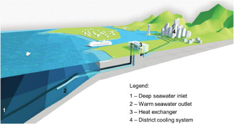

Country level
=============

Deep seawater cooling and desalination: Combining seawater air conditioning and desalination
--------------------------------------------------------------------------------------------

**Hunt, J.D., Weber, N. de A. B., Zakeri, B. et al. (2021), Sustainable Cities and Society**

In tropical climates, the energy consumed by heating, ventilation and air conditioning can exceed 50% of the total energy consumption of a building.
The demand for cooling is rising steadily, driven by global warming and rapidly increasing living standards in developing economies.
In addition, there is a rise ... `Read more → <https://www.sciencedirect.com/science/article/pii/S2210670721005333>`_
