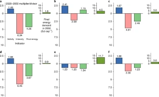
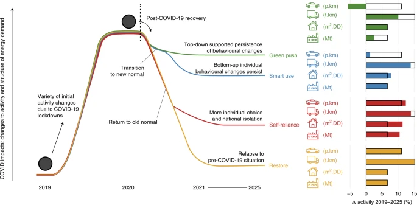

Global focus
============

Energy investment needs for fulfilling the Paris Agreement and achieving the Sustainable Development Goals
----------------------------------------------------------------------------------------------------------
.. figure:: ../_static/publication_figures/10.1038-s41560-018-0179-z.webp
   :width: 250px
   :align: right

Low-carbon investments are necessary for driving the energy system transformation that is called for by both the Paris Agreement and Sustainable Development Goals.
Improving understanding of the scale and nature of these investments under diverging technology and policy futures is therefore of great importance ...  :doc:`Read more →<10.1038-s41560-018-0179-z>`

A low energy demand scenario for meeting the 1.5 °C target and sustainable development goals without negative emission technologies
--------------------------------------------------------------------------------------------------------------------------------------

Scenarios that limit global warming to 1.5 °C describe major transformations in energy supply and ever-rising energy demand.
Here, we provide a contrasting perspective by developing a narrative of future change based on observable trends that results in low energy demand.
We describe and quantify changes in ... :doc:`Read more →<10.1038-s41560-018-0172-6>`

Climate mitigation scenarios with persistent COVID-19-related energy demand changes
-----------------------------------------------------------------------------------

The COVID-19 pandemic caused radical temporary breaks with past energy use trends.
How post-pandemic recovery will impact the longer-term energy transition is unclear.
Here we present a set of global COVID-19 shock-and-recovery scenarios that systematically explore the effect of demand changes persisting.
Our  ... :doc:`Read more →<10.1038-s41560-021-00904-8>`
