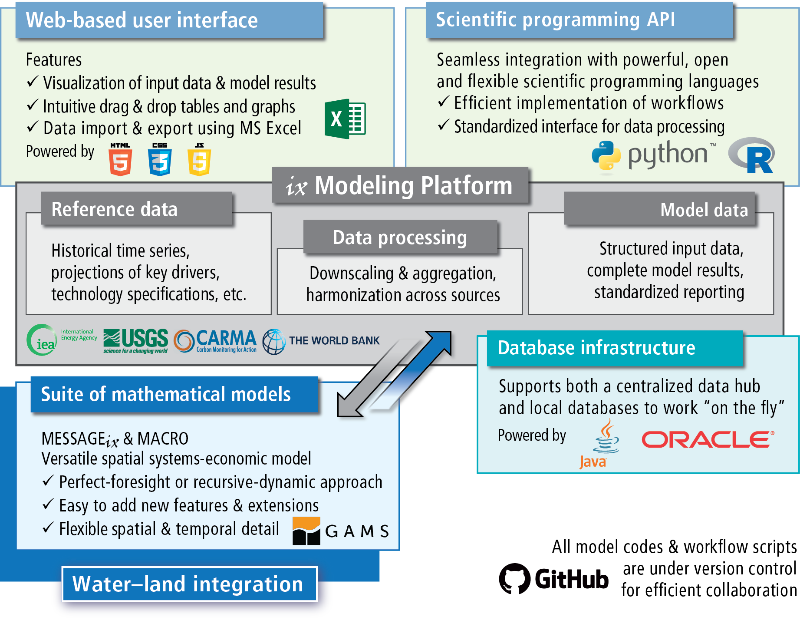

|MESSAGEix| framework overview
==============================

|MESSAGEix| is a *framework* that can be used to develop and run many different
*models*, each describing a different energy system. Models in the |MESSAGEix|
framework can range from very simple (as in the :doc:`tutorials`) to highly
detailed (e.g. the MESSAGE-GLOBIOM global model).

   Components and their interlinkages in the |ixmp| (source
   :cite:`huppmann_messageix_2018`): web-based user interface, scientific
   programming interface, modeling platform, database backend, implementation
   of the |MESSAGEix| mathematical model formulation.

Supported features
------------------

The framework allows direct and explicit representation of:

- Energy **technologies** with arbitrary inputs and outputs, that can be used
  to describe a “reference energy system,” including:

  - the fuel supply chain,
  - conversion technologies from primary to secondary energy forms,
  - transmission and distribution (e.g. of electricity), and
  - final demand for energy services.

- **Vintaging** of capacity, early retirement and decommissioning of
  technologies.
- System integration of **variable renewable energy sources** (based on
  Sullivan et al., 2013 :cite:`sullivan_VRE_2013` and Johnson et al., 2016
  :cite:`johnson_VRE_2016`).
- Soft relaxation of **dynamic constraints** on new capacity and activity
  (Keppo and Strubegger, 2010 :cite:`keppo_short_2010`).
- **Perfect-foresight** and **dynamic-recursive** (myopic) solution algorithms.

.. _running:

Running a model
---------------

There are three ways to run a |MESSAGEix| model:

1. Via Python or R APIs using the packages/libraries :mod:`ixmp` and
   :mod:`message_ix`, calling :meth:`message_ix.Scenario.solve`. (See the
   :doc:`tutorials`.)

2. Using the file ``MESSAGE_master.gms``, where the scenario name (i.e., the
   gdx input file), the optimization horizon (perfect foresight or myopic/
   rolling-horizon version), and other options can be defined explicitly.

   *This approach is recommended for users who prefer to work via GAMS IDE or
   other text editors to set the model specifications.*

3. Directly from the command line calling the file ``MESSAGE_run.gms`` (see the
   `auto-doc page`_). The scenario name and other arguments can be passed as
   command line parameters::

       $ gams MESSAGE_run.gms --in="<data-file>" --out="<output-file>"

Auto-generated documentation for the model run scripts is provided:

.. toctree::

   model/MESSAGE_run
   model/MESSAGE-MACRO_run

.. _`tutorials`: tutorials.html

.. _`auto-doc page`: model/MESSAGE_run.html
