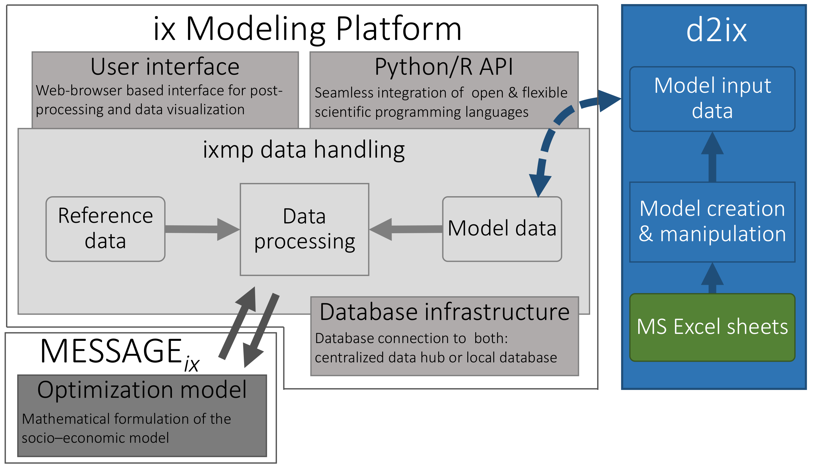

Tools
=====

This page shows a section of modeling tools which has been developed based on |MESSAGEix|.
It is not guaranteed that the tools listed on this page are maintained.

d2ix: A Model Input-Data Management and Analysis Tool for MESSAGEix
-------------------------------------------------------------------

See the code on `GitHub → <https://github.com/tum-ewk/d2ix>`_

:cite:ct:`d2ix`

Bottom-up integrated assessment models, like |MESSAGEix|, depend on the description of the capabilities and limitations of technological, economical and ecological parameters, and their development over long-time horizons.
Even small models of a few nodes, technologies and model years require input-data sets ... `Read more → <https://www.mdpi.com/1996-1073/12/8/1483/htm>`_
