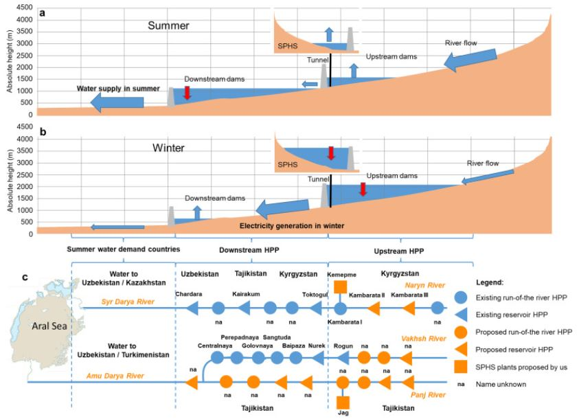
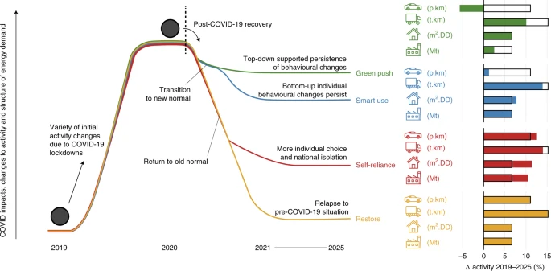
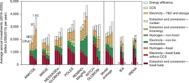
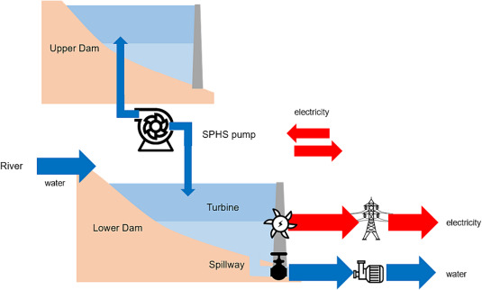
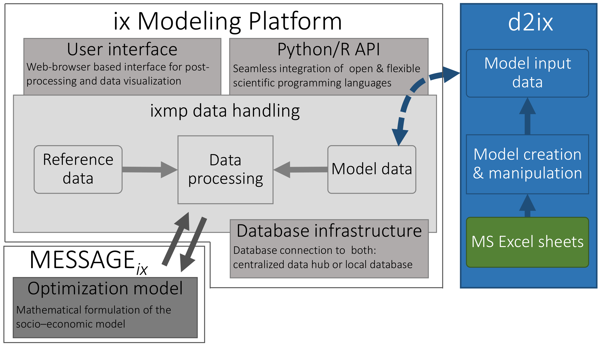

Usage in publications, projects, and tools
******************************************

This page contains information on **usage and applications** of the |MESSAGEix| framework in academic *publications* and research *projects*.
It also lists *tools* that have been developed by researchers beyond the IIASA ECE program to extend or complement |MESSAGEix|.

.. contents::
   :local:
   :depth: 1

Because the model formulation is flexible, users (individuals and groups) of |MESSAGEix| have built a wide variety of concrete models to study research questions in a range of domains and fields.
Model outputs are also used in a variety of ways, notably to inform policy-makers and other stakeholders facing energy systems challenges and decisions.

The list is not exhaustive, but provided to illustrate the wide range of possible applications of |MESSAGEix| for current and prospective users, and also to encourage knowledge exchange within the |MESSAGEix| user community.

To add your publication, tool, or project to this page, see :doc:`sharing`.

.. _publications:

Publications
============

The following is a selection of academic publications in which |MESSAGEix| was used to carry out energy systems research.
For each, the spatial scope/resolution, keywords and specific usage of |MESSAGEix| are described.

Role of energy storage in energy and water security in Central Asia
-----------------------------------------------------------------------------------

:cite:ct:`Zakeri-2022`

- **Spatial**: Regional (Central Asia), multi-country including Kazakhstan, Kyrgyzstan, Tajikistan, Turkmenistan, and Uzbekistan
- **Keywords**: Energy storage, seasonal pumped hydropower storage, water management, renewable energy systems, energy policy, electricity storage, energy model
- **Usage**: Model the energy-water system of Central Asia with 12 sub-annual time slices and analyze the role of energy and water storage solutions.
- **Data and code**: Data and scripts for building the model are openly available on `Github <https://github.com/iiasa/central-asia-storage>`__

Central Asia has faced major energy and water security challenges. Technic… `Read more → <https://doi.org/10.1016/j.est.2022.104587>`__

Climate mitigation scenarios with persistent COVID-19-related energy demand changes
-----------------------------------------------------------------------------------

:cite:ct:`Kikstra-2021`

- **Spatial**: Global, :ref:`11-region aggregation <message-ix-models:R11>`
- **Keywords**: Climate-change mitigation, energy and behaviour, energy supply and demand
- **Usage**: Capture global economy, energy and climate dynamics and feedbacks in the medium-to-long term, including regionally heterogeneous responses to the COVID-19 emergency.

The COVID-19 pandemic caused radical temporary breaks with past energy use… `Read more → <https://www.nature.com/articles/s41560-021-00904-8>`__

Deep seawater cooling and desalination: Combining seawater air conditioning and desalination
--------------------------------------------------------------------------------------------
.. figure:: _static/usage_figures/10.1016-j.scs.2021.103257.jpg
   :width: 250px
   :align: right

:cite:ct:`Hunt-2021`

- **Spatial**: Malé, Maldives
- **Keywords**: Building cooling, industrial cooling, energy efficiency, seawater air conditioning, low temperature thermal desalination, vertical farming
- **Usage**: Simulate Malé´s cooling and water services demand and optimize the renewable energy supply.

In tropical climates, the energy consumed by heating, ventilation and air… `Read more → <https://www.sciencedirect.com/science/article/pii/S2210670721005333>`__

Energy investment needs for fulfilling the Paris Agreement and achieving the Sustainable Development Goals
----------------------------------------------------------------------------------------------------------

:cite:ct:`McCollum-2018`

- **Spatial**: Global
- **Keywords**: Energy and society, finance, socioeconomic scenarios
- **Usage**: Calculate SDG investment needs with a diverse set of approaches within a multi-model analysis.

Low-carbon investments are necessary for driving the energy system… `Read more → <https://www.nature.com/articles/s41560-018-0179-z>`__

A low energy demand scenario for meeting the 1.5 °C target and sustainable development goals without negative emission technologies
-----------------------------------------------------------------------------------------------------------------------------------
.. figure:: _static/usage_figures/10.1038-s41560-018-0172-6.webp
   :width: 250px
   :align: right

:cite:ct:`Grubler-2018`

- **Spatial**: Global
- **Keywords**: Energy modelling, socioeconomic scenarios
- **Usage**: Calculate the energy supply impacts by imposing three types of constraints.

Scenarios that limit global warming to 1.5 °C describe major… `Read more → <https://www.nature.com/articles/s41560-018-0172-6>`__

Seasonal pumped hydropower storage role in responding to climate change impacts on the Brazilian electrical sector
------------------------------------------------------------------------------------------------------------------

:cite:ct:`Weber-2024`

- **Spatial**: Brazil
- **Keywords**: Energy modelling, energy variability
- **Usage**: Evaluate how best to shift Brazil to 100% renewable energy by using seasonal pumped hydropower storage.
- **Code**: `On GitHub. <https://github.com/natiweber/BESMM/tree/main>`_

Since Brazil's major energy resources are renewable and directly... `Read more→ <https://www.sciencedirect.com/science/article/pii/S2352152X2400834X>`__

.. _tools:

Tools
=====

|MESSAGEix| and :mod:`ixmp` provide a robust feature set for modeling.
However, these features are *general-purpose*, so some users have developed additional tools that extend or complement |MESSAGEix| to serve specific use-cases or needs.

.. note:: It is not guaranteed that the tools listed in this section are maintained.

d2ix: A Model Input-Data Management and Analysis Tool for MESSAGEix
-------------------------------------------------------------------

:cite:ct:`Zipperle-Orthofer-2019`

- **Goal**: Manageable, comprehensible, and traceable representation of input data.
- **Features**: Spreadsheet interface that enables presentation and editing of model input data in a concise form.
- **GitHub**: https://github.com/tum-ewk/d2ix

Bottom-up integrated assessment models, like |MESSAGEix|, depend on the… `Read more → <https://www.mdpi.com/1996-1073/12/8/1483/htm>`__

.. _projects:

Projects
========

For research projects of the IIASA Energy, Climate, and Environment Program that use |MESSAGEix|, visit https://iiasa.ac.at/web/ece/Projects.html.
