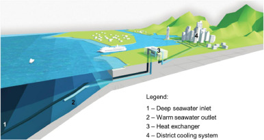
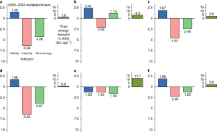

Information on publications, tools and projects
===============================================

.. contents::
   :local:

.. _publications:

Publications
------------

In the following a section of publication are shown in which |MESSAGEix| is used.
For every publication the regional scope, keywords and the usage of |MESSAGEix| are described.

Climate mitigation scenarios with persistent COVID-19-related energy demand changes
~~~~~~~~~~~~~~~~~~~~~~~~~~~~~~~~~~~~~~~~~~~~~~~~~~~~~~~~~~~~~~~~~~~~~~~~~~~~~~~~~~~
.. figure:: _static/usage_figures/41560_2021_904.webp
   :width: 250px
   :align: right

:cite:ct:`Kikstra2021`

- **Region**: Global
- **Keywords**: Climate-change mitigation, energy and behaviour, energy supply and demand
- **Usage**: Capture global economy, energy and climate dynamics and feedbacks in the medium-to-long term, including regionally heterogeneous responses to the COVID-19 emergency.

The COVID-19 pandemic caused radical temporary breaks with past energy use ... `Read more → <https://www.nature.com/articles/s41560-021-00904-8>`_

Deep seawater cooling and desalination: Combining seawater air conditioning and desalination
~~~~~~~~~~~~~~~~~~~~~~~~~~~~~~~~~~~~~~~~~~~~~~~~~~~~~~~~~~~~~~~~~~~~~~~~~~~~~~~~~~~~~~~~~~~~

:cite:ct:`HUNT2021103257`

- **Region**: Malé, Maldives
- **Keywords**: Building cooling, industrial cooling, energy efficiency, seawater air conditioning, low temperature thermal desalination, vertical farming
- **Usage**: Simulate Malé´s cooling and water services demand and optimize the renewable energy supply.

In tropical climates, the energy consumed by heating, ventilation and air ... `Read more → <https://www.sciencedirect.com/science/article/pii/S2210670721005333>`_

Energy investment needs for fulfilling the Paris Agreement and achieving the Sustainable Development Goals
~~~~~~~~~~~~~~~~~~~~~~~~~~~~~~~~~~~~~~~~~~~~~~~~~~~~~~~~~~~~~~~~~~~~~~~~~~~~~~~~~~~~~~~~~~~~~~~~~~~~~~~~~~
.. figure:: _static/usage_figures/10.1038-s41560-018-0179-z.webp
   :width: 250px
   :align: right

:cite:ct:`McCollum2018`

- **Region**: Global
- **Keywords**: Energy and society, finance, socioeconomic scenarios
- **Usage**:

Low-carbon investments are necessary for driving the energy system ...  `Read more → <https://www.nature.com/articles/s41560-018-0179-z>`_

A low energy demand scenario for meeting the 1.5 °C target and sustainable development goals without negative emission technologies
~~~~~~~~~~~~~~~~~~~~~~~~~~~~~~~~~~~~~~~~~~~~~~~~~~~~~~~~~~~~~~~~~~~~~~~~~~~~~~~~~~~~~~~~~~~~~~~~~~~~~~~~~~~~~~~~~~~~~~~~~~~~~~~~~~~~~~

:cite:ct:`Grubler2018`

- **Region**: Global
- **Keywords**: Energy modelling, socioeconomic scenarios
- **Usage**:

Scenarios that limit global warming to 1.5 °C describe major ... `Read more → <https://www.nature.com/articles/s41560-018-0172-6>`_

.. _tools:

Tools
-----

This page section a section of modeling tools which has been developed based on |MESSAGEix|.

*It is not guaranteed that the tools listed on this page are maintained.*

d2ix: A Model Input-Data Management and Analysis Tool for MESSAGEix
~~~~~~~~~~~~~~~~~~~~~~~~~~~~~~~~~~~~~~~~~~~~~~~~~~~~~~~~~~~~~~~~~~~
.. figure:: _static/usage_figures/10.3390-en12081483.png
   :width: 250px
   :align: right

:cite:ct:`d2ix`

- **Goal**: Manageable, comprehensible, and traceable representation of input-data.
- **Output**: Spreadsheet interface (d2ix) that enables presentation and editing of model input-data in a concise form.
- **GitHub**: https://github.com/tum-ewk/d2ix

Bottom-up integrated assessment models, like |MESSAGEix|, depend on the ... `Read more → <https://www.mdpi.com/1996-1073/12/8/1483/htm>`_

.. _projects:

Projects
--------

For research projects of the Energy, Climate, and Environment Program with the usage of |MESSAGEix|, please take a look `here → <https://iiasa.ac.at/web/ece/Projects.html>`_